# Probability

In this lesson, we will review a few key concepts in probability including:

- Discrete distributions
- Joint probabilities
- Conditional probabilities

The basics are simple. Probabilities are numbers between 0 and 1 that represent
the likelihood of an event occurring. The probability of an event that is
certain to occur is 1. The probability of an event that is certain not to occur
is 0. The probability of an event that has a 50% chance of occurring is 0.5.
The probability of all events that can occur is 1.

## Discrete Distributions

A discrete distribution is a probability distribution that can take on only
discrete values. For example, a coin toss can only result in two possible
outcomes: heads or tails. The probability of heads is 0.5 and the probability
of tails is 0.5. The probability distribution of a coin toss is a discrete
distribution.

When the events are independent, the probability of multiple events occurring
is the product of their probabilities.

## Joint Probabilities

The joint probability of two events is the probability that both events occur.
The joint probability of two events is the product of their probabilities and
is written as:

$P(X,Y) = P(X)P(Y)$

This is the probability of both X AND Y occurring.

### Example: Independence

The probability that three consecutive (independent) coin tosses results in heads is:

$0.5 \cdot 0.5 \cdot 0.5 = 0.125$.

The probability of there being at least three heads in four coin tosses:

Look at all the possibilities:

- HHHH
- HHHT
- HHTH
- HTHH
- THHH

There are five possibilities. The probability of getting each exact combination is
$1/16$, which is $0.5\cdot 0.5 \cdot 0.5 \cdot 0.5$. You then multiply the probabilities
of all the combinations to get the total probability, thus, the probability of there
being at least three heads in four coin tosses is $5 \cdot 1/16 = 0.3125$.

### Example: Dependent Events

Suppose you have a bias coin, where the probabilities of the second toss somehow depend on the outcome of the first toss.

Given:
- $P(X_1=H) = 0.5$
- $P(X_2=H|X_1=H) = 0.9$ (a biased coin)
- $P(X_1=T) = 0.5$
- $P(X_2=T|X_1=T) = 0.8$ (a biased coin)

What is the probability of getting two heads in a row?

$P(X_1=H) \cdot P(X_2=H|X_1=H) = 0.5 \cdot 0.9 = 0.45$

What is the probability of getting heads on the second toss?

$P(X_2=H) = P(X_2=H|X_1=H) \cdot P(X_1=H) + P(X_2=H|X_1=T) \cdot P(X_1=T) = 0.9\cdot 0.5 + 0.2\cdot 0.5 = 0.55$

Note that $P(X_2=H|X_1=T) = 1 - P(X_2=T|X_1=T) = 1-0.8=0.2$

### Lessons

Total probability:

$P(Y) = \sum_{X} P(Y|X)P(X)$

$P(\neg X|Y) = 1 - P(X|Y)$

Note: you can never negate your conditional variable Y and assume that the probabilities add up to one.

### Example: Cancer Test

Let's look at the probability of having cancer and a positive test result. Let's say

Given:

- $P(C) = 0.01$
- $P(\neg C) = 0.99$
- $P(T|C) = 0.9$
- $P(F|C) = 0.1$
- $P(T|\neg C) = 0.2$
- $P(F|\neg C) = 0.8$

Then:

- $P(T,C) = P(T|C)P(C) = 0.9 * 0.01 = 0.009$
- $P(F,C) = P(F|C)P(C) = 0.1 * 0.01 = 0.001$
- $P(T,\neg C) = 0.198$
- $P(F,\neg C) = 0.002$

## Bayes Rule

Bayes rule is really just the statement of conditional probability, where B is the evidence (we know about it), and A is what we care about (the hypothesis):

$P(A|B) = \frac{P(A,B)}{P(B)}$

The numerator comes from the joint probability of A and B. The denominator is the total
probability of B.

The numerator can be expanded to give the typical form of Bayes rule:

$P(A|B) = \frac{P(B|A)\cdot P(A)}{P(B)}$

The denominator can be expanded to give the total probability of B:

$P(B) = \sum_{A} P(B|A)\cdot P(A)$

In words, Bayes rule says that the probability of A given B is equal to the probability
of B given A times the probability of A divided by the probability of B.

$Posterior = \frac{Likelihood \cdot Prior}{Marginal Likelihood}$

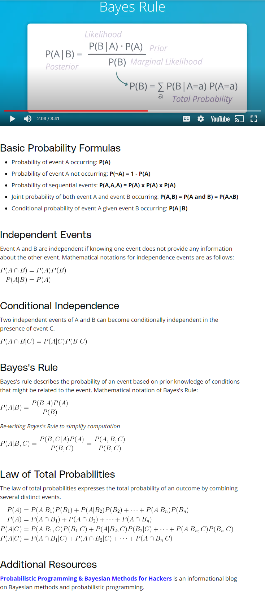

\newpage 

## Naive Bayes

Naive Bayes is a simple classifier that uses Bayes rule to classify data. It is naive
because it assumes that all features are independent. This is a naive assumption, but it
works well in practice.

Naive Bayes is a supervised machine learning algorithm that can be trained to classify
data into multi-class categories. In the heart of the Naive Bayes algorithm is the
probabilistic model that computes the conditional probabilities of the input features
and assigns the probability distributions to each of the possible classes.

In this lesson, we will:

- Review the conditional probability and Bayes Rule
- Learn how the Naive Bayes algorithm works

Great Video on Bayes Theorem: [https://www.youtube.com/watch?v=pQgO1KF90yU&t=304s](https://www.youtube.com/watch?v=pQgO1KF90yU&t=304s)

Bayes Theorem basically says that because you know something about the situation, you
can remove possibilities from your universe. For example, in the video, there is someone
that passes by quickly wearing a red sweater. Since we know they are wearing a red
sweater, we can remove all the people that are not wearing a red sweater from our
universe of possibilities. But when we do that the total probability of our universe no
longer sums to 1. So we have to normalize the probabilities of the remaining
possibilities to sum to 1. This is what Bayes Theorem does.

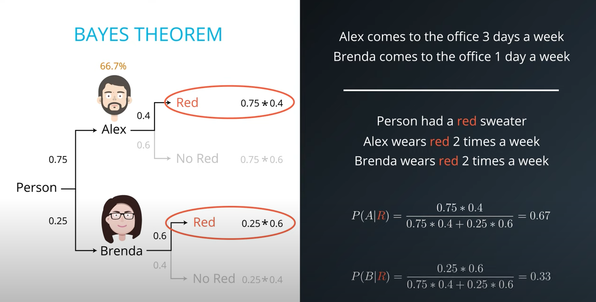
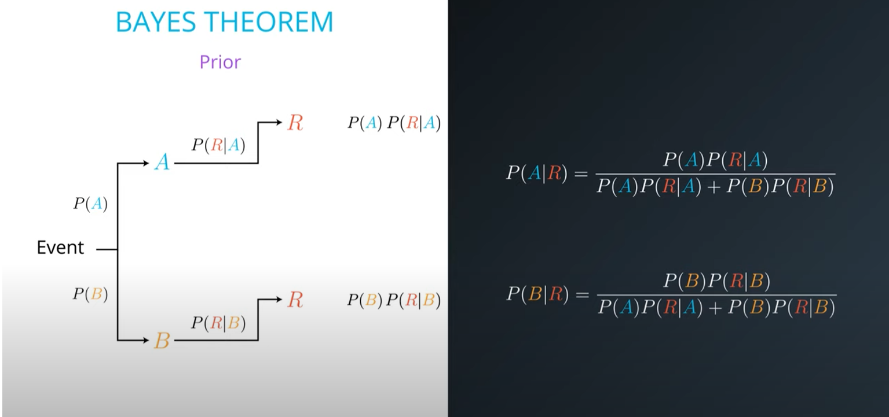

### False Positives

False positives are when you predict that something is true when it is not. For example,
if you predict that someone has cancer when they do not, that is a false positive.
Suppose you have a test that is 99% accurate. That means that if you have cancer, the
test will be positive 99% of the time. But if you do not have cancer, the test will be
positive 1% of the time. So if you test positive, what is the probability that you have
cancer? It is not 99%. It is actually 50%. This is because the probability of having
cancer is very low. So even though the test is 99% accurate, the probability of having
cancer is so low that the probability of a false positive is actually higher than the
probability of a true positive.

It really comes down to a comparison between the accuracy of the test and the prevalence
of the disease in the population. If the prevalence of the disease is low, then the
accuracy of the test has to be very high in order to have a low false positive rate.

In the following example, the accuracy of the test is 99%, but the probability of being
sick is only 1 in every 10,000 people, or 0.01%. So the probability of a false positive
is actually higher than the probability of a true positive. The chances of being sick in
this case, even though you tested positive with a test that is 99%, is less than 1%.

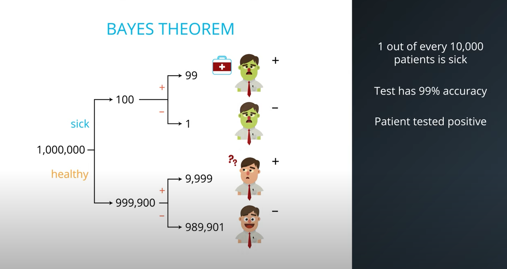
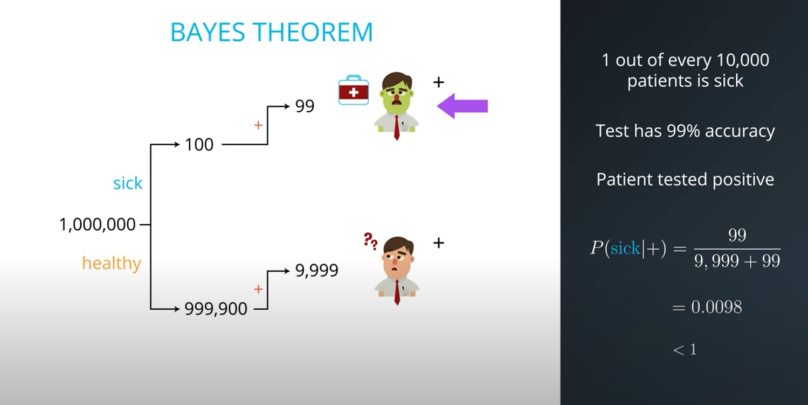

### The Naive Bayes Algorithm

We want to know the probability of a categorical class given some input values. For
example, we want to know the probability that an email is spam (or valid) given the
words in the email.

$P(spam|'easy', 'money', 'cheap') \propto P('easy'|spam) \cdot P('money'|spam) \cdot P('cheap'|spam) \cdot P(spam)$
$P(valid|'easy', 'money', 'cheap') \propto P('easy'|spam) \cdot P('money'|not spam) \cdot P('cheap'|valid) \cdot P(valid)$

The fact that we are multiplying the probabilities together is the naive part of the
algorithm. It assumes that the input values are independent. For example, you cannot
assume that the probability of it being 'hot' and 'cold' outside at the same time are
independent (the probability of that would be zero). But the assumption works well in
practice.

The Naive Bayes algorithm is as follows:

- Calculate the prior probability of each class (spam vs valid)
- Calculate the conditional probability of each class given each input value 
- Multiply the conditional probabilities of each input value together, for each class
- Multiply the prior probability of each class by the conditional probability of each
  input value for that class
- Normalize the probabilities for each class so that they sum to 1 (divide each class
  probability by the sum of the class probabilities)
- The class with the highest probability is the prediction
- Return the prediction

### Classification vs Regression

Classification is when you are trying to predict a categorical class. For example, you
might be trying to predict whether an email is spam or valid. Regression is when you are
trying to predict a continuous value. For example, you might be trying to predict the
price of a house given its size and location.

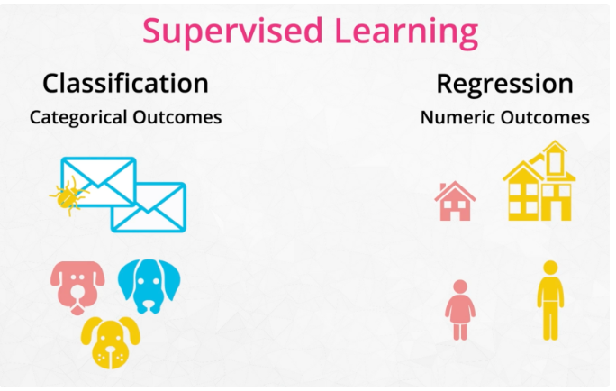

## Evaluating Classification Models

Now that we have made predictions on our test set, our next goal is to evaluate how well
our model is doing. There are various mechanisms for doing so, so first let's review
them.

### Accuracy

**Accuracy** measures how often the classifier makes the correct prediction. It’s the
ratio of the number of correct predictions to the total number of predictions (the
number of test data points). 

$\rightarrow$ The closer to 1 the better! Less than one means you inaccurately classified both spam and non-spam emails

### Precision

**Precision** tells us what proportion of messages we classified as spam, actually were
spam. It is a ratio of true positives (words classified as spam, and which actually are
spam) to all positives (all words classified as spam, regardless of whether that was the
correct classification). In other words, precision is the ratio of

`[True Positives/(True Positives + False Positives)]`

$\rightarrow$ The closer to 1 the better! Less than one means too many false positives (too many good emails were filtered as spam)

$\rightarrow$ REMEMBER: Precision = False positives (How many innocent victims)

### Recall

**Recall (sensitivity)** tells us what proportion of messages that actually were spam
were classified by us as spam. It is a ratio of true positives (words classified as
spam, and which actually are spam) to all the words that were actually spam. In other
words, recall is the ratio of

`[True Positives/(True Positives + False Negatives)]`

$\rightarrow$ The closer to 1 the better! Less than one means too many false negatives (too many misses or spam emails got through)

$\rightarrow$ REMEMBER: Recall = False negatives (How many misses)

For classification problems that are skewed in their classification distributions like
in our case - for example if we had 100 text messages and only 2 were spam and the other
98 weren't - accuracy by itself is not a very good metric. We could classify 90 messages
as not spam (including the 2 that were spam but we classify them as not spam, hence they
would be false negatives) and 10 as spam (all 10 false positives) and still get a
reasonably good accuracy score. For such cases, precision and recall come in very handy. 

### F1 Score

These two metrics can be combined to get the **F1 score**, which is the weighted average of the precision and recall scores. This score can range from 0 to 1, with 1 being the best possible F1 score.

## Bayes Nets

Bayes nets are a graphical representation of a joint probability distribution. It tells
you how some uncertain variables effect other uncertain variables. They are a directed
acyclic graph (DAG) where the nodes represent random variables and the edges represent
conditional dependencies. The joint probability distribution is the product of the
conditional probabilities of each node given its parents. The joint probability
distribution is the product of the conditional probabilities of each node given its
parents.

### Bayes Nets Components

Bayes Nets is a graph that has no directed cycles, also known as a directed acyclic graph, or DAG. To build Bayes Nets, we need to specify the following:

1. **Random Variables**: Each node corresponds to a random variable.
2. **Conditional Relations**: A set of directed links or arrows connects pairs of nodes.
3. **Probability Distributions**: Each node has a conditional probability distribution that quantifies the effect of the parents on the node.

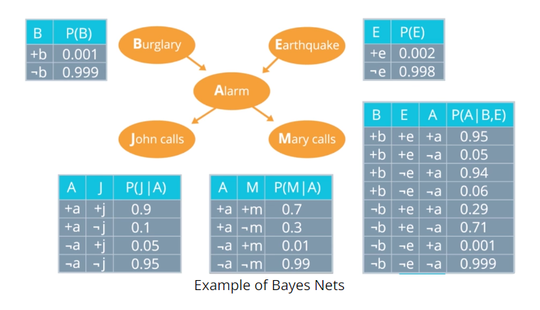

### Bayes Rule (revisited)

Recall that Bayes Rule is:

$P(A|B) = \frac{P(B|A)\cdot P(A)}{P(B)}$

The denominator be difficult to determine. Instead we can write the complimentary probability as: 

$P(\neg A|B) = \frac{P(B|\neg A)\cdot P(\neg A)}{P(B)}$

And we now that $P(A|B) + P(\neg A|B) = 1$, so we can write:

So now the denominator (i.e. the normalizing constant) is the sum of the two probabilities:

$P(B) = P(B|A)\cdot P(A) + P(B|\neg A)\cdot P(\neg A)$

And Bayes Rule becomes:

$P(A|B) = \frac{P(B|A)\cdot P(A)}{P(B|A)\cdot P(A) + P(B|\neg A)\cdot P(\neg A)}$

With no need to explicitly know or compute P(B).

### Abosolute vs Conditional Independence

Absolute independence is when two events are independent of each other. Conditional
independence is when two events are independent of each other given a third event. One
does not imply the other.

### Explaining Away

Explaining away is when two events are independent of each other, but when you know the
value of a third event, they are no longer independent. For example, if you know that it
is raining, then the probability of the sprinkler being on is no longer independent of
the probability of the sprinkler being on given that it is raining. If you see or
observe one of the causes of an event, it makes it less likely and helps to "explain
away" the event, making it less likely to be caused by the other causes.

## Advantages of General Bayes Net

The key advantage of general bayes net is that it requires fewer parameters to specify
the joint probability distribution. For example, if you have 5 random variables, each
with 2 possible values, then the joint probability distribution has $2^{5} = 31$. But if
you have a bayes net with 5 random variables, each with 2 possible values, then you only
have 10 parameters. It scales further to very large networks.

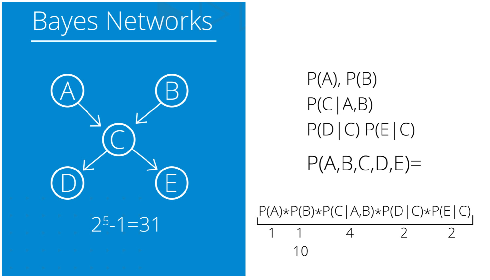

Any variable that has $k$ inputs has $2^{k}$ parameters, as shown in the following
figure.

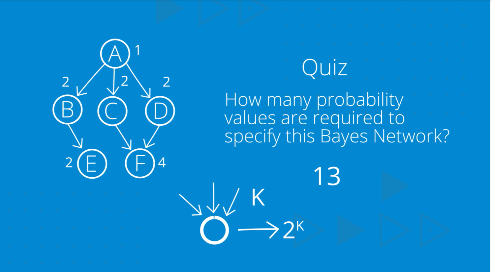

Notice how many fewer parameters there are in the bayes net compared to the joint
probability distribution.

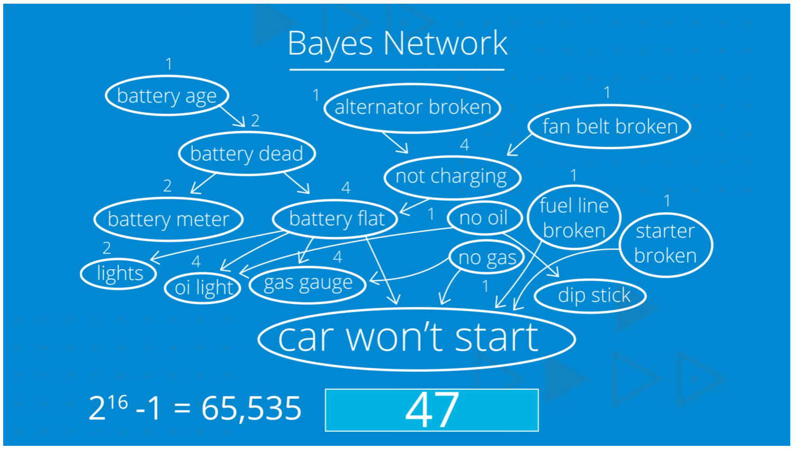

### D-Separation (Reachability)

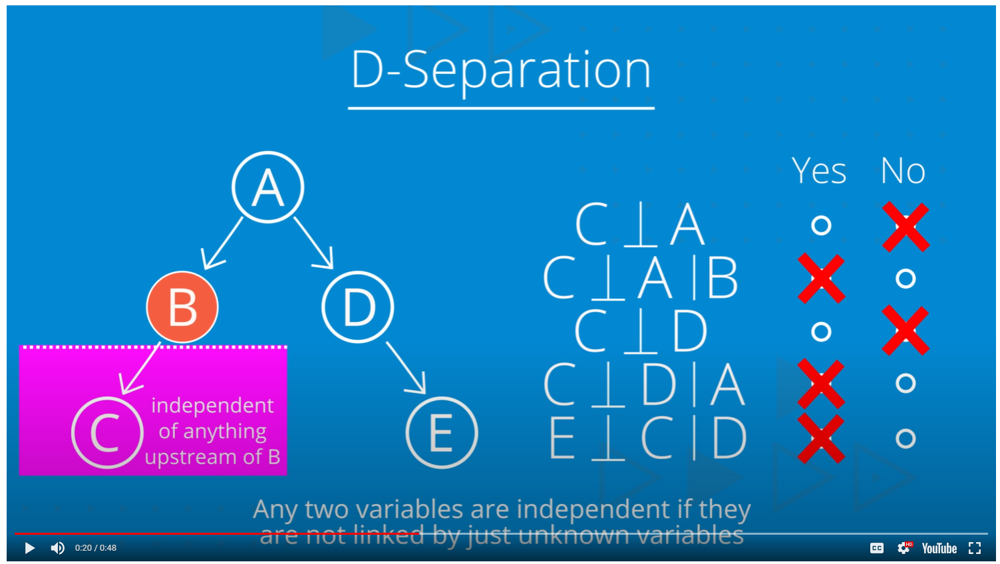

Knowledge of the variable $C$ renders to previously independent variables $A$ and $B$, dependent. This is called **explaining away**.

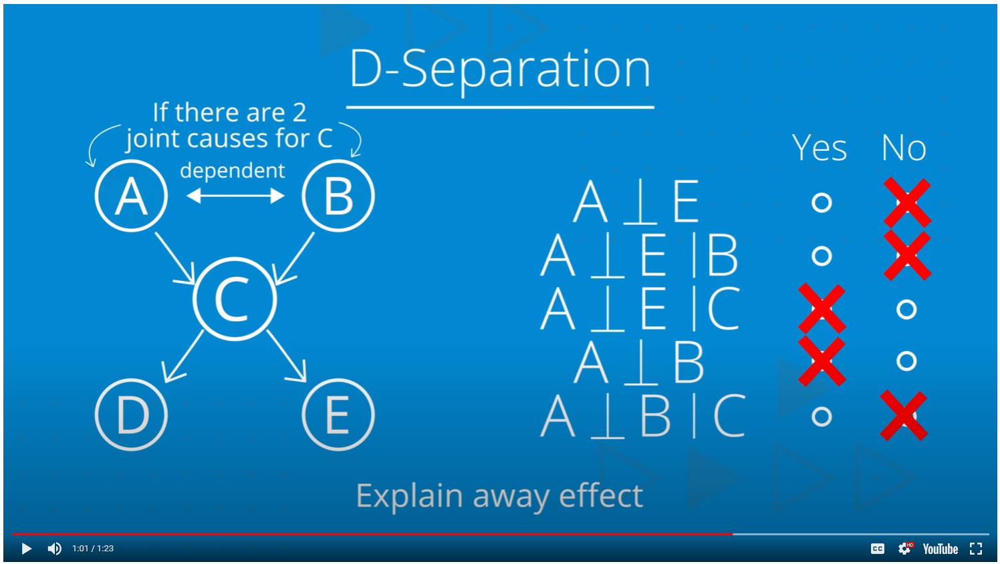

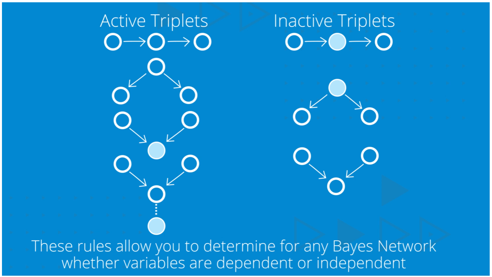

## Summary

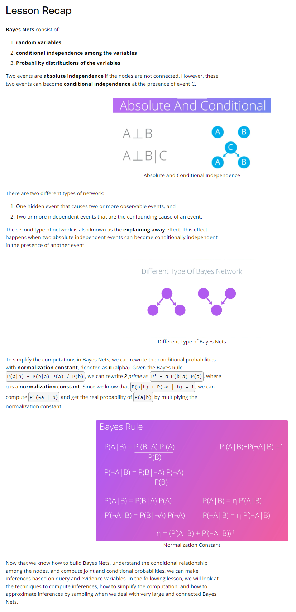

## Probabilistic Inference

- Evidence = Input (known values)
- Query = Output (unknown values that we want to know)
- Hidden = Intermediate (unkown values that we do not care about)

[Great Youtube Video on Probabilistic Inference](https://www.youtube.com/watch?v=YZt5PKPVvCg&t=222s)

In a traditional algorithm or function, you have inputs and the function computes the
outputs. It is unidirectional. However, in probabilistic inference, you could switch to
any combination of parameters are your evidence and/or query.

In probabilistic inference, the output is a joint probability distribution. You may be
interested in the output/query parameters that have the highest probability values given
the input/evidence provided.
 
### Inference by Enumeration

Inference by enumeration is a brute force method of computing the joint probability. It
goes through **all** the possibilities and computes the joint probability for each one.
It is very inefficient.

Example:

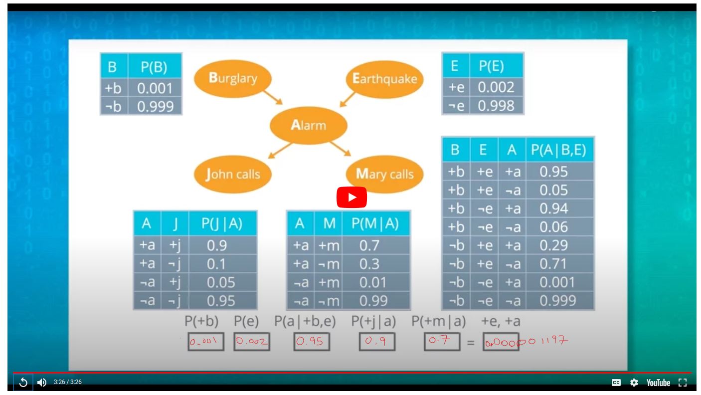

## Appendix

### Challenges in understanding dependence and conditional probability

Conditional probability can indeed be challenging to understand because it involves
assessing the probability of one event occurring given that another event has already
occurred. This concept can be counterintuitive and is prone to misunderstandings. Here
are a few reasons why conditional probability might seem mirky and hard to grasp:

- Context Dependency: The interpretation of conditional probability heavily depends on the
context of the problem. Different scenarios may lead to different interpretations,
making it challenging to develop a universal intuition for all situations.

- Subjectivity: In some cases, determining whether events are independent or dependent may
involve subjective judgments. People may have different opinions on what constitutes a
relevant or influential factor, leading to different assessments of conditional
probability.

- Ambiguity in Language: The way problems are phrased can introduce ambiguity and
confusion. Language plays a crucial role in conveying the conditions and dependencies,
and slight variations in wording can lead to different interpretations.

- Assumption of Independence: Sometimes, people assume independence when it might not be
  justified. In real-world scenarios, events are often interconnected in complex ways,
  and making the assumption of independence without proper justification can lead to
  incorrect conclusions.

- Lack of Concrete Examples: Understanding conditional probability often relies on
  concrete examples. If examples are abstract or not relatable, it can be challenging to
  build an intuitive understanding of the concept.

- Mathematical Complexity: The formal mathematical expressions of conditional
probability, such as the conditional probability formula,  $P(A | B)= \frac{P(B)}{P(A
\cap B)}$​, can be intimidating for individuals who are not comfortable with
mathematical notation. The manipulation of probabilities can add an extra layer of
complexity.

To enhance understanding, it's helpful to work through concrete examples,
visualize problems using diagrams or charts, and practice solving problems
involving conditional probability. Developing a solid foundation in basic
probability concepts can also contribute to a clearer understanding of
conditional probability. Additionally, seeking clarification when faced with
ambiguous or unclear statements in problem descriptions can be valuable in
overcoming misunderstandings.

### Dependence vs Causality 

Understanding the difference between dependence and causality is crucial, as
these concepts are related but distinct. Let's clarify each term:

#### Dependence

- Definition: Dependence refers to a statistical relationship between two
  variables or events. If the occurrence (or non-occurrence) of one event
  provides information about the occurrence of another event, the two events
  are considered dependent. 

- Example: If you know that it is raining (event A), it is more likely that
  people will use umbrellas (event B). In this case, the events "rain" and "use
  of umbrellas" are dependent.

#### Causality

- Definition: Causality refers to a cause-and-effect relationship between two
  variables or events. If one event causes another, they are considered
  causally related. Causation implies a direct influence, where changes in one
  variable result in changes in another.

- Example: Smoking (event A) is a cause of lung cancer (event B). In this case,
  the act of smoking directly influences the occurrence of lung cancer. It's
  important to note that dependence does not necessarily imply causality. Two
  events can be statistically related without one causing the other.
  Additionally, causality implies a more direct and often temporal
  relationship, whereas dependence is a broader concept encompassing various
  types of statistical relationships.

#### In the context of conditional probability:

- Dependence: If events A and B are dependent, knowing the occurrence or
  non-occurrence of one event provides information about the probability of the
  other event.
- Causality: If A causes B, then knowing the occurrence of A not only provides
  information about the probability of B but also implies a direct influence of
  A on B.

Confusion can arise when people mistakenly interpret dependence as causality or
vice versa. It's essential to carefully consider the nature of the relationship
between events and be cautious about making causal claims based solely on
observational data. Methods like randomized controlled trials are often used to
establish causal relationships by controlling for confounding factors and
randomizing the exposure.

### Variable Elimination

- R = Raining
- T = Traffic (depends on Raining)
- L = Late for meeting (depends on Traffic)

Question: Am I going to be late? 

$P(+l) = \sum_r \sum_t P(r) P(t | r) P (+l | t)$

With the probability broken down this way, we can write out the tables (like a
multidimensional matrix) as follows:

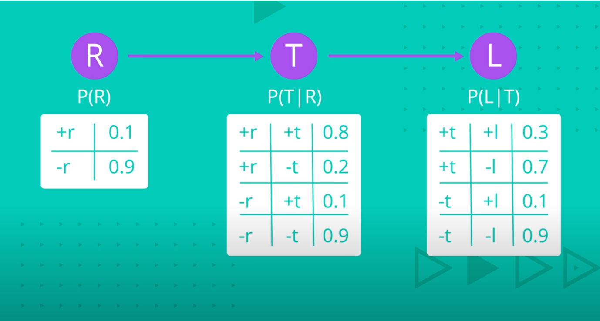

A continous process of joining variables together (multiplying values in the
tables) followed by variable elimination (adding all values that lead to the
new variable).

## Approximate Inference Sampling

If we don't know the values in the probability tables, then we can still
proceed by sampling the space. We sample the space and reject any samples that
do not concern us (i.e. the conditional probability that we are interested in).
For example, if we are intersted in the grass being wet, which depends on it
being cloudy, then we can reject any sample for which it is not cloudy. Thi is
called **Rejection Sampling**. The problem is that if the probability you're
interested in is inherently **low** or unlikely, then we end of throwing out a
lot of samples.

### Likelihood Weighting

Likelihood weighting gives us a way to keep all the samples. We fix the
variables we want (like only sample points that are cloudy). We can assign a
probability to each sample and use them to weight the samples which makes
everything consistent.

### Gibbs Sampling

Gibbs sampling is a Markov Chain Monte Carlo (MCMC) method that generates a
sequence of samples from the joint probability distribution of a set of random
variables. It is a special case of the Metropolis-Hastings algorithm, where the
proposal distribution is a conditional distribution of a single variable given
the current values of all other variables. Gibbs sampling is particularly
useful for sampling from high-dimensional distributions, where direct sampling
methods may be impractical. It is also used for approximate inference in
Bayesian networks and other probabilistic models. The algorithm iteratively
samples each variable from its conditional distribution given the current values
of all other variables, effectively exploring the joint distribution of the
variables. The samples generated by Gibbs sampling can be used to estimate
marginal probabilities, compute expectations, and perform other probabilistic
inference tasks.

## Lesson Summary

In this lesson, we learned how to make inferences (query) from Bayes Nets based on the
evidence variables and the conditional probabilities as configured in the Bayes Nets. of
the evidence variables as defined in the network.

There are two algorithms that to compute exact inferences:

- **Enumeration**: the query’s conditional probability is computed by summing the terms from
  the full joint distribution.
- **Variable Elimination**: an algorithm to reduce the enumeration computation by doing the
  repeated calculations once and store the results for later re-use.

However, it is computationally expensive to make exact inference from a large and highly
connected Bayes Network. In these cases, we can approximate inferences by sampling.
Sampling is a technique to select and count the occurances of the query and evidence
variables to estimate the probability distributions in the network. We looked at four
sampling techniques as follows:

- **Direct sampling**: the simplest form of samples generation from a known probability
  distribution. For example, to sample the odds of Head or Tail in a coin flip, we can
  randomly generate the events based on uniform probability distribution (assuming we
  use a non-bias coin).
- **Rejection sampling**: generates samples from the known distribution in the network
  and rejects the non-matching evidence.
- **Likelihood sampling**: is similar to rejection sampling but generating only events
  that are consistent with the evidence.
- **Gibbs sampling**: initiates an arbitrary state and generates the next state by
  randomly sampling a non-evidence variable, while keeping all evidence variables fixed.

In the final lesson, we will learn the Hidden Markov Model (HMM) and its application in
the Natural Language Processing task to tag Parts of Speech. HMM assumes unobservable
states and computes the transition and emission probabilities from one state to another.

### Additional Resources

The following are other informational resources on this topic:

- [Gibbs Sampling](https://en.wikipedia.org/wiki/Gibbs_sampling) & [Metropolis-Hastings](https://en.wikipedia.org/wiki/Metropolis%E2%80%93Hastings_algorithm)
- [Markov Chain Monte Carlo Sampling](https://en.wikipedia.org/wiki/Markov_chain_Monte_Carlo)
- [Variational Inference](https://docs.pymc.io/api/inference.html)
- [Bayesian Neural Networks](https://arxiv.org/abs/1801.07710)

\newpage

Hello world
